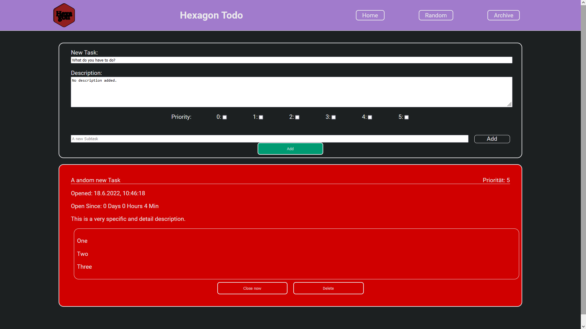

<div id="top"></div>

<!-- [![Contributors][contributors-shield]][contributors-url]
[![Forks][forks-shield]][forks-url]
[![Stargazers][stars-shield]][stars-url]
[![Issues][issues-shield]][issues-url]
[![MIT License][license-shield]][license-url]
[![LinkedIn][linkedin-shield]][linkedin-url] -->

<!-- PROJECT LOGO -->
<br />
<div align="center">
  <a href="https://github.com/PhilippDemmelmair/todo">
    
  </a>

<h3 align="center">Hexagon Todo</h3>

  <p align="center">
    Make your tasks hexa-GONE!
    <br />
    <a href="https://github.com/PhilippDemmelmair/todo"><strong>Explore the docs »</strong></a>
    <br />
    <br />
    <!-- <a href="https://github.com/github_username/repo_name">View Demo</a> -->
    ·
    <a href="https://github.com/PhilippDemmelmair/todo/issues">Report Bug</a><br>
    ·
    <a href="https://github.com/PhilippDemmelmair/todo/issues">Request Feature</a>
  </p>
</div>

<!-- TABLE OF CONTENTS -->
<details>
  <summary>Table of Contents</summary>
  <ol>
    <li>
      <a href="#about-the-project">About The Project</a>
      <ul>
        <li><a href="#built-with">Built With</a></li>
      </ul>
    </li>
    <li>
      <a href="#getting-started">Getting Started</a>
      <ul>
        <li><a href="#prerequisites">Prerequisites</a></li>
        <li><a href="#installation">Installation</a></li>
      </ul>
    </li>
    <li><a href="#usage">Usage</a></li>
    <li><a href="#roadmap">Roadmap</a></li>
    <li><a href="#contributing">Contributing</a></li>
    <li><a href="#license">License</a></li>
    <li><a href="#contact">Contact</a></li>
    <li><a href="#acknowledgments">Acknowledgments</a></li>
  </ol>
</details>

<!-- ABOUT THE PROJECT -->

## About The Project

---

## 

## Hexagon - make your tasks hex-GONE!

---

<br><br>
This is a very simple Todo-App, to help you, to organize your tasks. The app was made, as a part of my attention in a bootcamp, so the first version is really simple and has very few features. Target was, to build a first complete React App and we chose a Todo app as a first example. Here you can find, what I have made out of it.
<br><br>
I plan to build on from this and update it from time to time, so stay tuned. Also, if you have any ideas for future features, I would like to hear from you.

<p align="right">(<a href="#top">back to top</a>)</p>

### Built With

- [React.js](https://reactjs.org/)
- [zustand](https://www.npmjs.com/package/zustand)
- [styled components](https://www.npmjs.com/package/styled-components)

<p align="right">(<a href="#top">back to top</a>)</p>

<!-- GETTING STARTED -->

## Getting Started

This is how you set up a copy of Hexagon locally. Just follow these simple steps and enjoy my little taskmanager.

### Prerequisites

You need npm.

```sh
npm install npm@latest -g
```

### Installation

1. Clone the repo
   ```sh
   git clone https://github.com/PhilippDemmelmair/todo
   ```
2. Install NPM packages
   ```sh
   npm install
   ```

### Starting

Use this command to start the application.

```sh
npm start
```

<p align="right">(<a href="#top">back to top</a>)</p>

<!-- USAGE EXAMPLES -->

## Usage

Use this app, when you want to have a nice little Todo-App, which you can use in your browser. Keep track of your tasks. Priritize them. You can also add little Subtasks. Aslo, you have the possibility to archive a completed task. Another feature is, that you can see how long your task is open or how long a completed task was open.

<p align="right">(<a href="#top">back to top</a>)</p>

<!-- ROADMAP -->

## Roadmap

- [x] Taskmanagment
  - [x] Subtasks
  - [x] Priorities
- [x] Archive
- [x] Timetracking
  - [x] Since when is a task open
  - [x] How long was a task open

<p align="right">(<a href="#top">back to top</a>)</p>

<!-- CONTRIBUTING -->

## Contributing

Contributions are what make the open source community such an amazing place to learn, inspire, and create. Any contributions you make are **greatly appreciated**.

If you have a suggestion that would make this better, please fork the repo and create a pull request. You can also simply open an issue with the tag "enhancement".
Don't forget to give the project a star! Thanks again!

1. Fork the Project
2. Create your Feature Branch (`git checkout -b feature/AmazingFeature`)
3. Commit your Changes (`git commit -m 'Add some AmazingFeature'`)
4. Push to the Branch (`git push origin feature/AmazingFeature`)
5. Open a Pull Request

<p align="right">(<a href="#top">back to top</a>)</p>

<!-- LICENSE -->

## License

Distributed under the MIT License.

<!-- See `LICENSE.txt` for more information. -->

<p align="right">(<a href="#top">back to top</a>)</p>

<!-- CONTACT -->

## Contact

Twitter: <a href="https://twitter.com/PhilDemmelmair">@PhilDemmelmair</a> <br>
LinkedIn: <a href="https://www.linkedin.com/in/philipp-demmelmair-45755a1b7/">@Philipp Demmelmair</a> <br>
E-Mail: <a href="mailto:donsilver24@gmail.com">donsilver24@gmail.com</a>

Project Link: [https://github.com/PhilippDemmelmair/todo](https://github.com/PhilippDemmelmair/todo)

<p align="right">(<a href="#top">back to top</a>)</p>

<!-- ACKNOWLEDGMENTS -->

<!-- ## Acknowledgments

- []()
- []()
- []() -->

<p align="right">(<a href="#top">back to top</a>)</p>

<!-- MARKDOWN LINKS & IMAGES -->
<!-- https://www.markdownguide.org/basic-syntax/#reference-style-links -->

[contributors-shield]: https://img.shields.io/github/contributors/github_username/repo_name.svg?style=for-the-badge
[contributors-url]: https://github.com/github_username/repo_name/graphs/contributors
[forks-shield]: https://img.shields.io/github/forks/github_username/repo_name.svg?style=for-the-badge
[forks-url]: https://github.com/github_username/repo_name/network/members
[stars-shield]: https://img.shields.io/github/stars/github_username/repo_name.svg?style=for-the-badge
[stars-url]: https://github.com/github_username/repo_name/stargazers
[issues-shield]: https://img.shields.io/github/issues/github_username/repo_name.svg?style=for-the-badge
[issues-url]: https://github.com/github_username/repo_name/issues
[license-shield]: https://img.shields.io/github/license/github_username/repo_name.svg?style=for-the-badge
[license-url]: https://github.com/github_username/repo_name/blob/master/LICENSE.txt
[linkedin-shield]: https://img.shields.io/badge/-LinkedIn-black.svg?style=for-the-badge&logo=linkedin&colorB=555
[linkedin-url]: https://linkedin.com/in/linkedin_username
[product-screenshot]: images/screenshot.png
